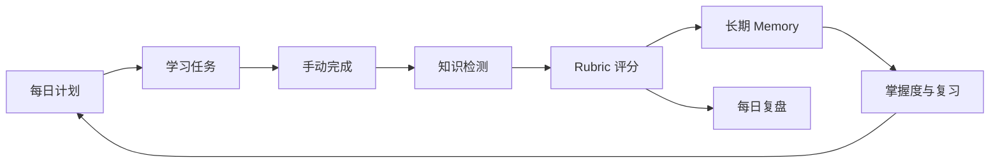
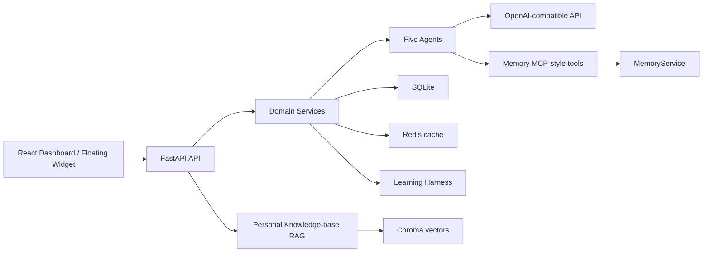

# LearnLoop

> LearnLoop 是一个 AI 学习闭环工具：将每日计划、知识检测、长期记忆和复盘连接起来，让每一次学习都能影响下一次行动。


## 为什么选择 LearnLoop

LearnLoop 面向希望持续学习、但不想把计划和复盘分散在多个工具中的个人学习者。它把“今天学什么”“是否真的掌握”“下次什么时候复习”串成一条可追踪的路径：

- **计划有依据**：Goal Planner 参考到期 Memory 与掌握度生成今日目标。
- **检测紧跟学习**：完成 Agent 知识任务后生成 3～5 个问题，并按 Rubric 评估回答。
- **记忆服务行动**：Memory Curator 提取薄弱点、错因和收获，Mastery Service 更新掌握度与复习时间。
- **过程可复盘**：每日 Reflection 汇总任务、检测、Memory、LeetCode 记录和掌握度变化。
- **边界清晰可审计**：Learning Harness 记录关键事件；Trace 展示流程，但不展示模型隐藏思维链。

LearnLoop 不是 Code Agent：它不会自动写代码、修改仓库、运行或提交 LeetCode。LeetCode 模块只记录用户手动完成情况、错因、收获和复习时间。

## 核心工作流



一次完整使用通常是：打开 Dashboard 查看今日任务，完成 Agent 知识主题或记录 LeetCode 学习；提交知识检测后查看评分与反馈；在 Memory、Mastery 和 Review 页面确认薄弱点、掌握度与下一次复习安排。右下角网页悬浮学习组件会显示任务、进度、待检测项目和提醒。

## 快速开始

### 环境要求

- Python 3.10+
- Node.js 20+
- npm 10+
- Redis 7（可选；不可用时会回退到 SQLite）

### 安装依赖

在仓库根目录执行：

```powershell
cd backend
py -3.10 -m venv .venv
.\\.venv\\Scripts\\Activate.ps1
python -m pip install -r requirements.txt
Copy-Item .env.example .env

cd ..\\frontend
npm install
```

### 配置并启动

在一个终端启动后端：

```powershell
cd backend
.\\.venv\\Scripts\\Activate.ps1
python -m uvicorn app.main:app --reload
```

在另一个终端启动前端：

```powershell
cd frontend
npm run dev
```

打开 `http://127.0.0.1:5173`。后端 API 默认运行在 `http://127.0.0.1:8000`，接口文档位于 `http://127.0.0.1:8000/docs`，健康检查为 `http://127.0.0.1:8000/api/health`。

### 第一次使用

1. 进入 Dashboard，触发今日计划生成。
2. 在 Knowledge 页面初始化知识主题，确认今日学习任务。
3. 完成一个 Agent 知识任务并提交 Quiz；也可以先记录一条 LeetCode 学习记录。
4. 查看 Evaluator 的 Rubric 评分，随后在 Memory、Mastery 和 Review 页面查看闭环结果。
5. 想用个人资料学习时，进入 Knowledge Base 创建 Markdown 笔记，点击向量化后到 RAG Chat 提问或生成 Quiz。

没有配置接口密钥时，五个 Agent 都会使用确定性方案或模板回退，仍可演示计划、检测、评分、记忆和复盘流程。

## 配置

配置文件为 `backend/.env`，可从 `backend/.env.example` 复制。下面是最小配置表：

| 变量 | 示例值 | 作用 |
| --- | --- | --- |
| `OPENAI_API_KEY` | `your_api_key` | 兼容 OpenAI 协议的服务接口密钥；可留空以使用回退方案 |
| `OPENAI_BASE_URL` | `https://api.deepseek.com` | 兼容 OpenAI 协议的接口地址 |
| `MODEL_NAME` | `deepseek-v4-flash` | Goal Planner、Quiz、Memory Curator、Reflection 使用的模型 |
| `EVAL_MODEL_NAME` | `deepseek-v4-flash` | Evaluator 使用的模型 |
| `DATABASE_URL` | `sqlite:///./learnloop.db` | SQLite 数据库连接 |
| `REDIS_URL` | `redis://localhost:6379/0` | Redis 连接；不可用时自动回退 |
| `EMBEDDING_PROVIDER` | `local` | 使用本地或 `openai-compatible` Embedding |
| `EMBEDDING_MODEL_NAME` | `sentence-transformers/paraphrase-multilingual-MiniLM-L12-v2` | 本地 Embedding 模型 |
| `CHROMA_PERSIST_DIR` | `./chroma_data` | Chroma 本地持久化目录 |
| `RAG_MIN_SIMILARITY` | `0.25` | RAG 最低相似度阈值 |

接口密钥只从环境变量读取，不写入数据库、Harness 或 Memory MCP。当前版本是使用 `user_id=default` 的单用户 MVP。

## 技术设计


### 分层与数据流



Agent 层只负责模型推理和结构化输出；数据库事务、缓存刷新和业务规则位于 Service 层；API 层负责请求校验和统一响应。Prompt 单独存放在 `backend/app/prompts/`。SQLite 是事实源，Redis 只承担缓存、会话恢复、提醒状态和用户级 LLM 限流。

### 五个 Agent 角色与回退方案

| Agent | 已实现职责 | 模型失败或不可用时的回退方案 |
| --- | --- | --- |
| Goal Planner | 根据到期 Memory、掌握度和目标生成今日计划 | 确定性学习计划 |
| Quiz Agent | 根据知识主题和关键点生成检测问题 | 预设问题 |
| Evaluator Agent | 按 40/30/20/10 Rubric 评分并生成反馈 | 基于规则的评估器 |
| Memory Curator | 提取、去重、合并薄弱点、错因和收获 | 使用结构化评估结果 |
| Reflection Agent | 汇总任务、Quiz、Memory、LeetCode、Mastery 生成复盘 | 模板复盘 |

### Memory 与 RAG 的边界

RAG 保存用户提供的学习资料，Memory 保存用户长期学习状态。笔记原文和 Chunk 不会整体写入 Memory；只有知识库 Quiz 评估产生的薄弱点，才进入既有的 Evaluator → Memory Curator → Mastery 链路。

| 对比项 | RAG | Memory |
| --- | --- | --- |
| 内容 | Markdown 笔记、知识材料、原文 Chunk | 薄弱点、错因、收获、复习计划 |
| 存储 | SQLite 文档/Chunk + Chroma 向量 | SQLite Memory 表 |
| 检索 | Embedding 相似度与来源 Chunk | 文本、topic、类型、到期时间 |
| 作用 | 为问答和 Quiz 提供可引用依据 | 调整目标、掌握度和复习计划 |

RAG 流程为：Markdown/Text → 标题解析 → 300～700 字符 Chunk（100 字符 overlap）→ Embedding → Chroma cosine 检索 → 来源约束回答。没有足够相似的 Chunk 时返回“知识库中没有足够依据”；模型调用失败时使用检索原文的引用式回退，不用外部知识补答。前端始终展示来源和检索片段。

### Memory MCP-style 工具

当前是项目内部固定 Tool Registry，不支持客户端动态注册、动态导入或任意系统操作。五个工具及边界如下：

| Tool | 功能 |
| --- | --- |
| `memory.search` | 按文本、topic、memory type 检索 |
| `memory.write` | 创建长期记忆 |
| `memory.update` | 更新允许字段 |
| `memory.list_due_reviews` | 查询到期复习记忆 |
| `memory.delete` | 删除不准确记忆 |

所有 handler 只调用现有 MemoryService，成功和失败均写入 Harness；Memory MCP 不持有 LLM API Key，也不能执行 Shell、读取任意文件或访问任意系统资源。

### 可审计性与安全边界

Learning Harness 记录计划、完成、检测、评分、Memory、掌握度、复习、提醒、工具调用以及 RAG 文档和检索事件。Trace 页面展示这些步骤与脱敏后的 Payload，不展示模型隐藏思维链；长字符串由后端截断，展开区域限制高度。Harness 自身写日志失败不会回滚或阻断主学习流程。

API Key、Token、Authorization、密码、系统 Prompt 和环境变量会自动脱敏。用户必须手动确认任务完成和 LeetCode 结果；RAG 只处理用户主动创建或在浏览器中选择的 Markdown/Text 内容。

### 主要页面与接口

- 页面：`/` Dashboard、`/knowledge` 知识主题、`/quiz/:sessionId` Quiz、`/memory` Memory、`/review` 复盘、`/harness` Trace、`/tools` Memory MCP、`/knowledge-base` 知识库、`/rag-chat` 来源约束问答。
- 目标与任务：`GET /api/goals/today`、`POST /api/goals/plan`、`GET /api/tasks/today`。
- 学习检测：Quiz 生成、回答保存、评估与历史查询。
- 记忆与复盘：Memory CRUD、Mastery 查询、日报生成与查询。
- 工具与 RAG：`GET /api/tools/list`、`POST /api/tools/call`、`POST /api/rag/search`、`POST /api/rag/ask`、`POST /api/rag/generate-quiz`。

统一响应结构为：

```json
{
  "success": true,
  "data": {},
  "message": "Operation completed.",
  "cache_hit": false
}
```

## 路线图

路线图只记录当前尚未实现、且与产品方向直接相关的工作：

1. **认证**：加入用户认证、租户隔离和远程部署所需的权限边界。
2. **异步工作**：将耗时的模型调用、索引和复盘任务移入可观察的异步工作流。
3. **检索评估**：建立检索命中率、回答依据充分性、引用准确率等可重复评估。
4. **桌面交付**：将网页悬浮学习组件交付为真正的桌面悬浮学习窗口。

## 贡献

欢迎围绕学习闭环、可审计性和安全边界提交问题单或合并请求。建议先说明问题场景和复现步骤，再提出与现有分层相匹配的改动；涉及 API、数据模型或 Agent 行为时，请同步补充测试和文档。提交前至少运行后端测试与前端生产构建：

```powershell
cd backend
python -m unittest discover -s tests -p 'test_branding.py' -v

cd ..\\frontend
npm run build
```

## 许可证

当前仓库尚未声明具体开源许可证。除非仓库新增正式许可证文件，否则请不要将代码用于需要明确授权的分发或商业场景；贡献者提交内容也应确保拥有相应权利。
